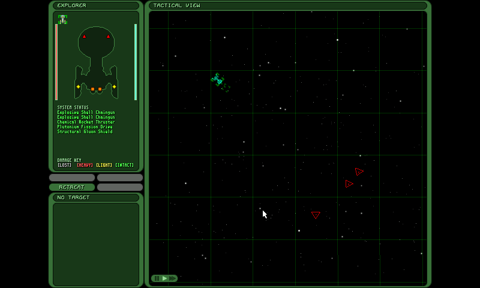

# Strange Adventure in Infinite Space

Strange Adventure in Infinite Space for Linux and Pandora.

This version is based on the official sources released by digital-eel, but slightly changed to build under Linux. The Windows version should still compile

You'l need cmake (v2.8 minimum), SDL and SDL_mixer.

It has been tested on OpenPandora. The Mods have been quickly tested and seems to work.

The demo and full data are include for convenience, in the folder demo

To build, simply create a build folder, then use cmake and make to build:
`mkdir build && cd build && cmake .. -DDATAS=on && make`
then launch the game with `./strange`

If you enjoyed this game, don't forget to go visit Digital Eel homepage: http://www.digital-eel.com/

NOTE: The gpl licence only apply to the source code. It doesn't apply to datas (that are free but not gpl'd).
